# Pop_os

INICIO DE LA INSTALACION DE POS-OS

Despues de montarlo en virtualBox pasamos a hacer su instalacion.

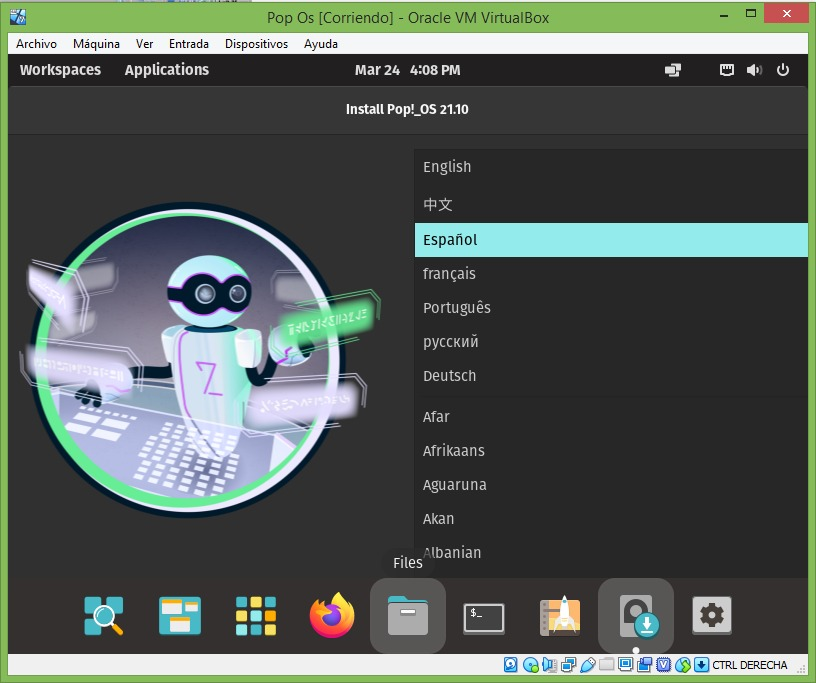

Procedimos a cambiar la configuraion del idioma a español.

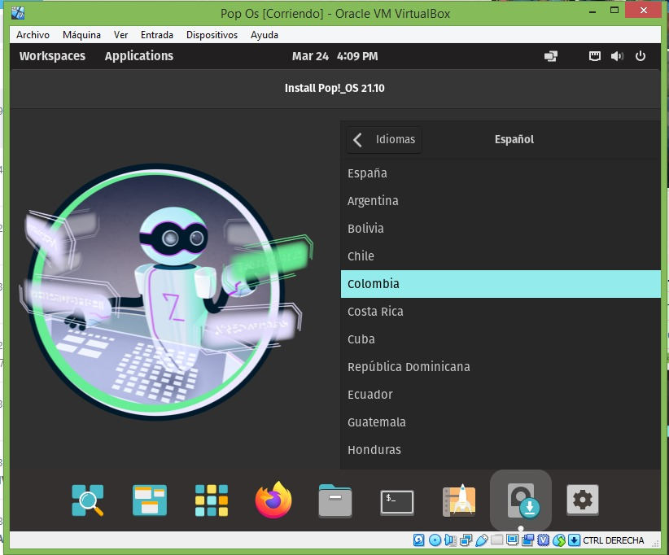

Procedimos a cambiar la configuraion del idioma a español y elegimos el pais para este caso colombia.

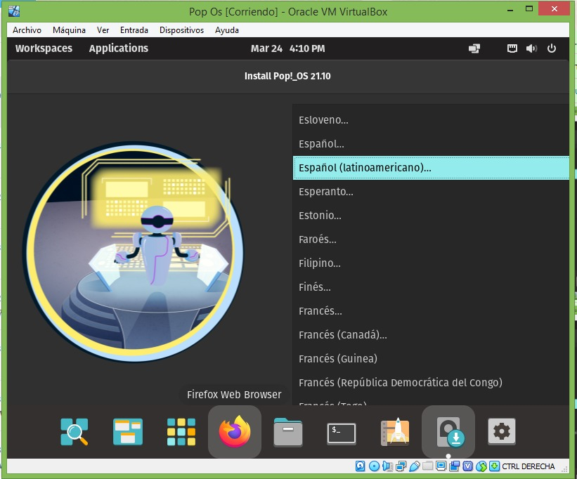

Procedimos a cambiar la configuraion del teclado a español latinoamericano.

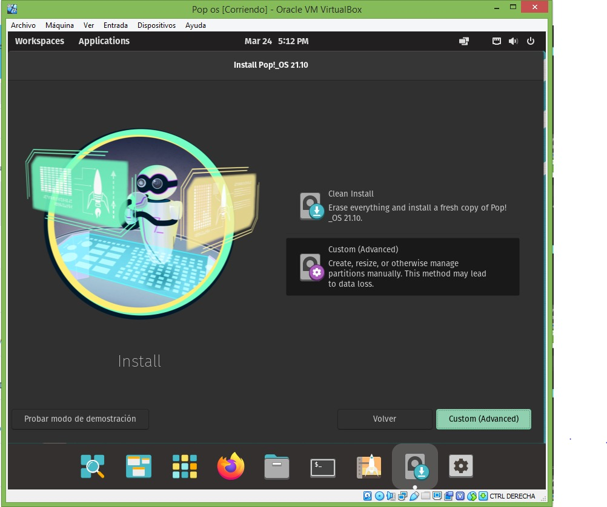

selecionamos custom(Advanced) para crear las particiones maunal mente.

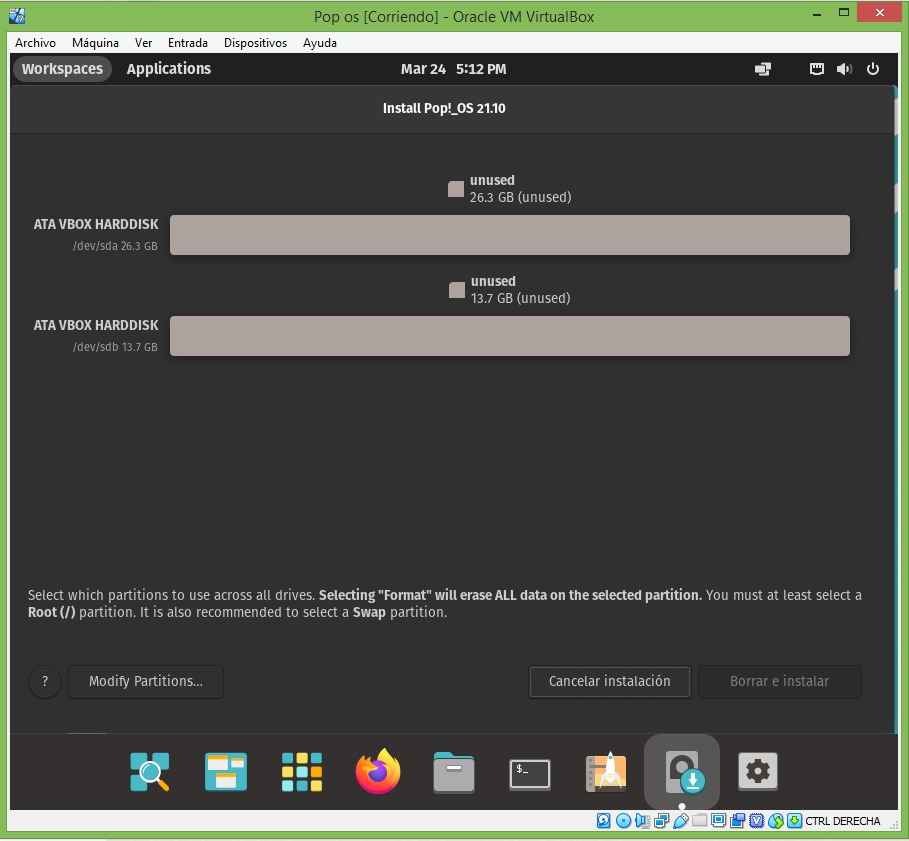

En este proceso es esta mostrando los discos que hay actualmente.

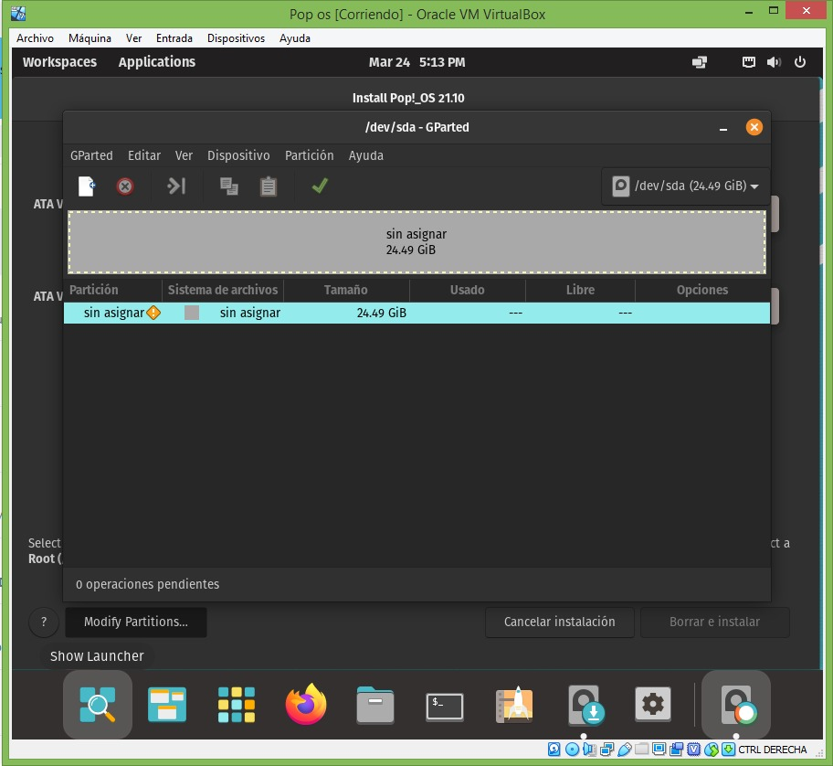

Selecionamos el disco que vamos a particionar.

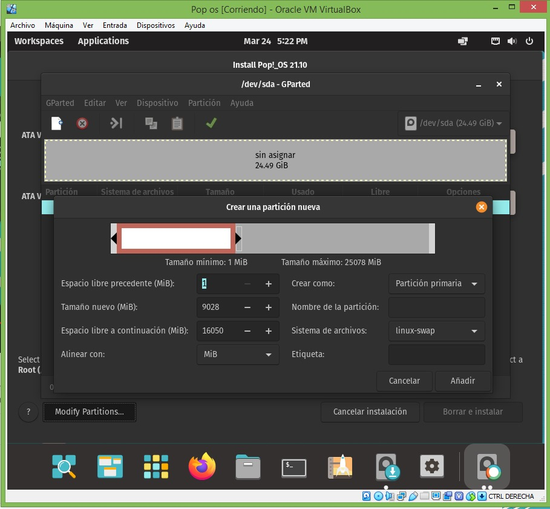

Al disco le creamos cada de las particiónes nuevas.

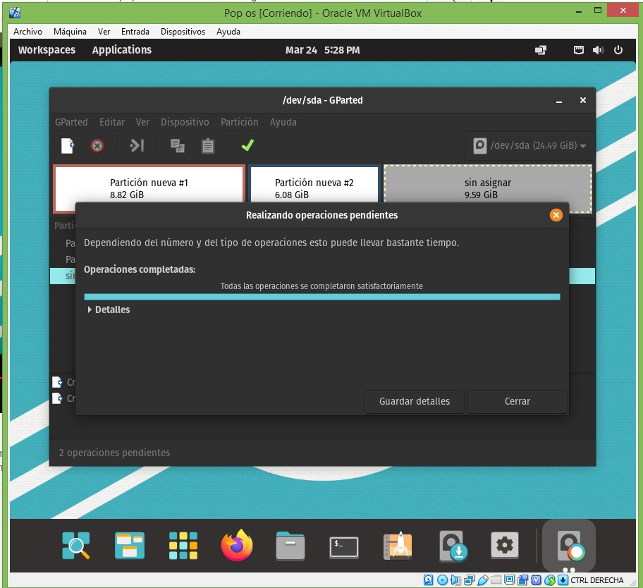

Teniendo las particiones uno y dos cada una con su respectivo tamaño

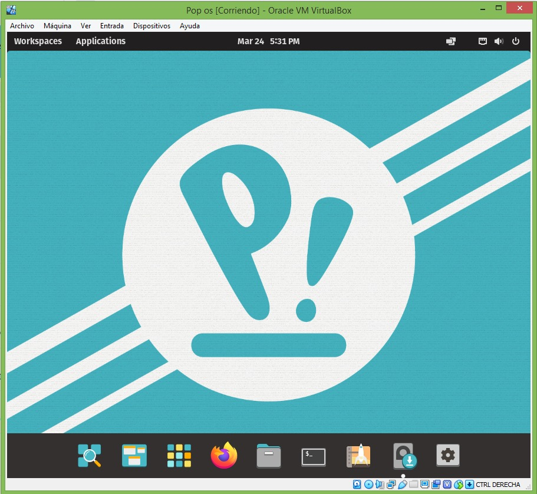

Nos indica que las particiones salieron satifactoriamente.

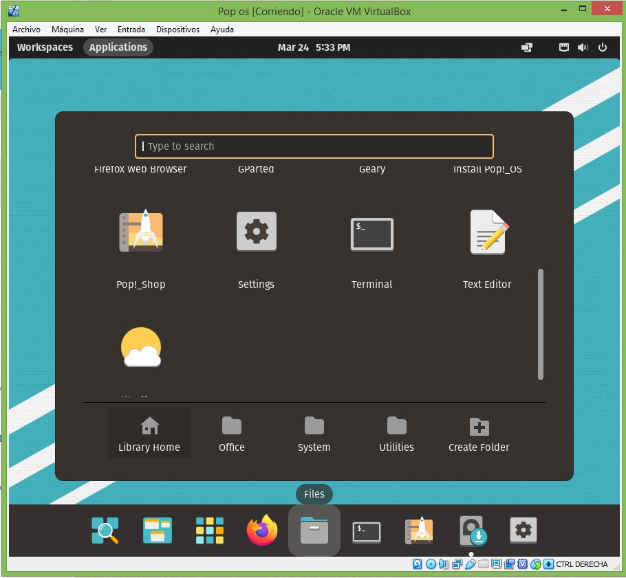

Buscamos la carpecta disk para poder ver como quedaron.

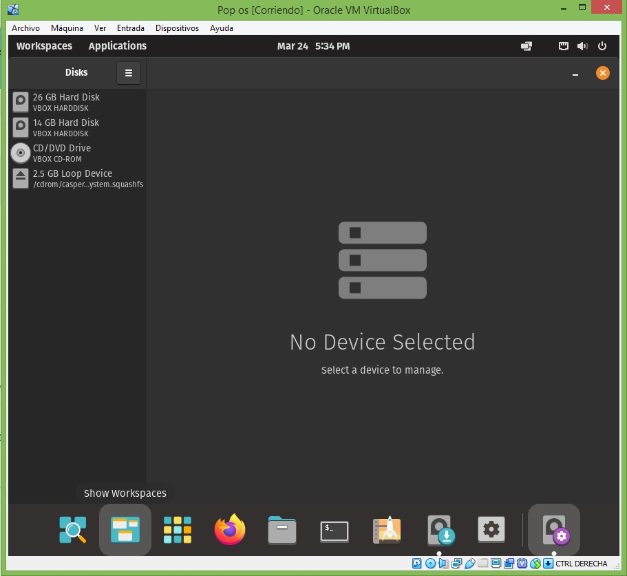

Buscamos la carpecta disk para poder ver como quedaron.

Nos damos cuenta que todos los discos aparecen. 

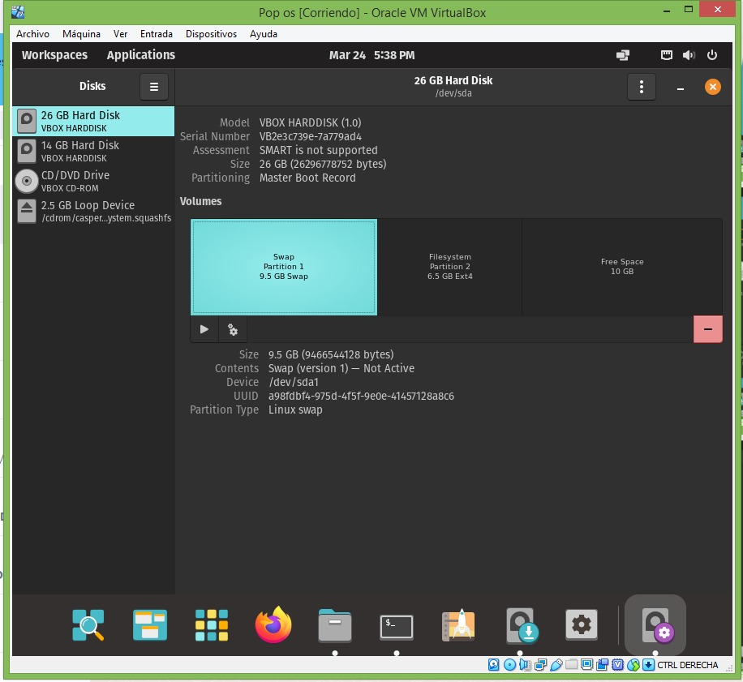

Nos damos cuenta que todos los discos aparecen. con su respectivo tamaño asignado.

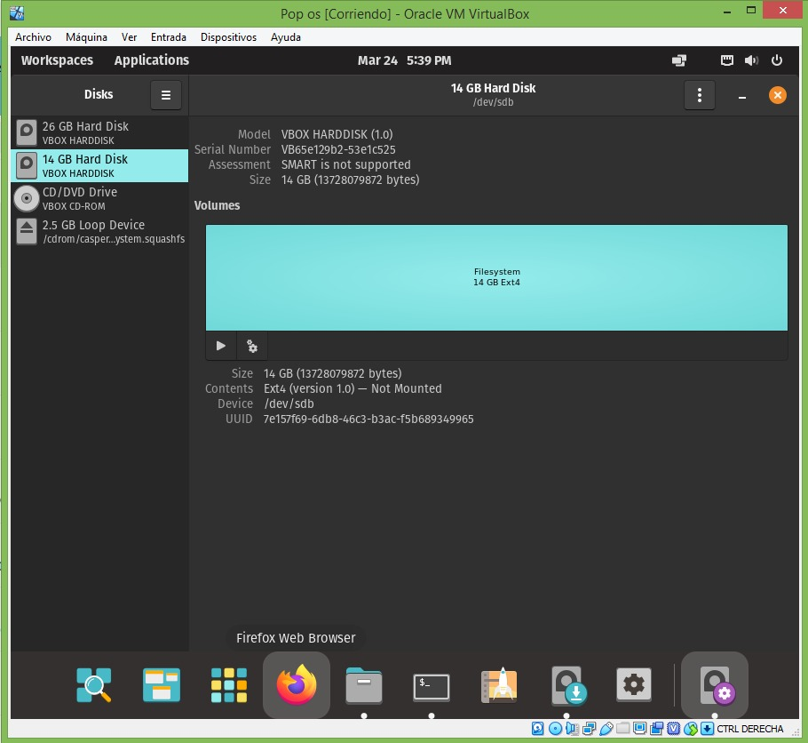

Se termino satifatoriamente la instalacion y particiones de los discos en el programa pos_os

## GRACIAS

